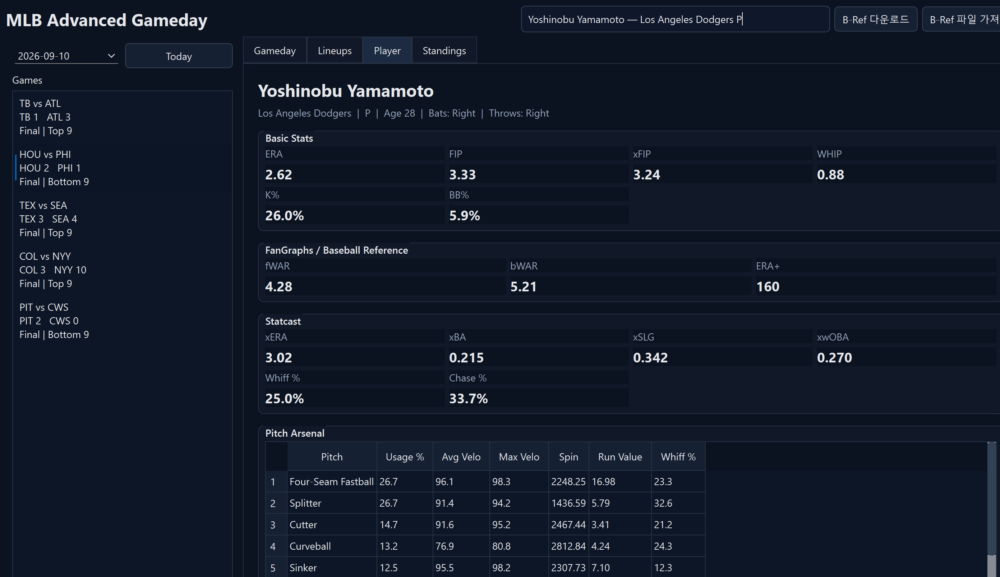

<div align="center">

# ⚾ Dugout Atlas

**경기의 흐름과 선수의 가치를 한 화면에서.**

더그아웃 아틀라스 · MLB 경기와 선수 분석을 위한 데스크톱 데이터 지도

Windows 데스크톱에서 MLB 실시간 경기와 세이버메트릭스를 함께 살펴보는 분석 앱입니다.

기존 MLB Advanced Gameday를 계승한 **Dugout Atlas v1.2**입니다.


[빠른 시작](#빠른-시작) · [주요 기능](#주요-기능) · [사용자 가이드](docs/USER_GUIDE.md) · [구조](ARCHITECTURE.md) · [변경 기록](CHANGELOG.md)

</div>

---

> **개발 중인 데스크톱 프로젝트입니다.** 현재 배포물은 Python 소스이며 별도 설치형 EXE는 제공하지 않습니다. 외부 통계의 최신성은 각 데이터 제공처의 갱신 시점에 따릅니다.

[소스 ZIP 다운로드](https://github.com/dhtjr1236-eng/dugout-atlas/archive/refs/heads/main.zip) · [문제 제보](https://github.com/dhtjr1236-eng/dugout-atlas/issues)

## 한눈에 보기



*사용자가 제공한 실제 실행 화면입니다. 이름 변경 전 촬영되어 상단에 이전 이름이 표시됩니다. 현재 앱 이름은 Dugout Atlas이며, 화면 속 통계는 촬영 당시 표시값입니다.*

| 화면 | 확인할 수 있는 내용 |
| :--- | :--- |
| **Gameday** | 날짜별 일정, 실시간 점수, 볼·스트라이크·아웃, 주자, 현재 타자·투수, 최근 플레이, Linescore 아래 득점 플레이 상세 |
| **Lineups** | 홈·원정 타순, 실제 등판한 투수 전원, 투수별 경기 기록 |
| **Player** | 성/이름 부분 검색, 시즌 선택, 기본 기록, WAR·wRC+·예상 성적·타구 품질·수비 지표·Running·Platoon Splits |
| **Compare** | 두 선수를 각각 검색해 역할에 맞는 주요 MLB/FanGraphs/B-Ref/Statcast 지표를 좌우 비교 |
| **Charts** | 타구 속도, Barrel%, Hard Hit%, 타자 WAR·wRC+ 연/월/일 추이, 투수 Statcast 연/월/일 구간, 구종 비율·구속·Run Value·Whiff% |
| **League** | 정규시즌 및 와일드카드 순위, 팀·리그 팀 통계 |

## 빠른 시작

**준비:** Windows 11, Python 3.12 이상, 인터넷 연결.

Python 설치 시 **Add python.exe to PATH**를 선택하세요. 자동 설치는 Python 3.12를 먼저 찾고, 없으면 PATH의 기본 Python을 사용합니다. 기본 Python도 3.12 이상이어야 합니다.

1. GitHub 저장소 상단의 **Code → Download ZIP**으로 소스를 내려받고 압축을 풉니다.
2. `install.bat`을 더블클릭해 실행 환경과 의존성을 설치합니다.
3. 설치 완료 후 `run.bat`을 더블클릭합니다.
4. 날짜와 경기를 선택하거나 상단 검색창에서 선수를 검색합니다.

설치 스크립트는 가상환경 생성, 의존성 설치, 문법 검사, 포함된 테스트 실행을 수행합니다. 문제가 있으면 [설치·문제 해결 가이드](docs/USER_GUIDE.md)를 참고하세요.

<details>
<summary>명령줄로 실행하기</summary>

프로젝트 폴더에서 다음 명령을 실행합니다.

```powershell
py -3.12 -m venv .venv
.\.venv\Scripts\python.exe -m pip install -r requirements.txt
.\.venv\Scripts\python.exe main.py
```

</details>

## 주요 기능

- **30초 자동 갱신:** 경기 상황과 라인업을 주기적으로 불러옵니다.
- **라이브 득점 플레이 상세:** Gameday Linescore 아래에 득점자 이름, 득점 방식(HR/2B/1B/SF/WP 등), 타점 수와 MLB play-by-play 설명을 표시합니다.
- **선수 검색 보강:** 이름 앞부분뿐 아니라 성이나 이름 중간 문자열로도 선수를 찾을 수 있습니다. 예: `Kikuchi` → `Yusei Kikuchi`.
- **선수 시즌 선택:** Player 화면의 선수 이름 옆에서 시즌을 선택할 수 있으며, 현재 시즌 기록이 없으면 선수의 가장 최근 MLB 시즌을 기본값으로 사용합니다.
- **Platoon Splits:** 타자는 Running 아래, 투수는 Statcast 흐름 아래에서 좌/우 상대 AVG·OBP·SLG·OPS·wRC+를 확인할 수 있습니다.
- **통합 선수 분석:** MLB 기본 기록에 FanGraphs, Baseball-Reference, Baseball Savant/Statcast 데이터를 결합합니다.
- **Running 분석:** 타자 Player 화면의 Defense 아래에 Running 패널을 추가했습니다. Baseball Savant 공식 Sprint Speed를 `ft/s` 단위로 표시하고, FanGraphs의 SB·CS와 `SB / (SB + CS)` 도루 성공률을 함께 표시합니다.
- **수비 OAA 소스 유지:** Defense의 OAA는 Baseball Savant 공식 OAA 리더보드 값만 사용합니다. v1.10.2의 별도 FanGraphs OAA 카드는 v1.11에서 제거했습니다.
- **선수 비교:** `Compare` 탭에서 Player A / Player B를 각각 자동완성 검색해 타자끼리 또는 투수끼리 핵심 지표를 바로 비교합니다. 타자-투수 혼합 비교는 공통 지표만 보여 잘못된 역할별 지표 비교를 피합니다.
- **FanGraphs 최신 시즌 반영:** 현재 시즌 fWAR/wRC+는 5분 캐시를 사용하고 선택 선수도 5분마다 자동 새로고침합니다.
- **타자 WAR / wRC+ 기간 선택:** 타자 차트에서 Yearly / Monthly / Daily(최근 14경기)로 전환할 수 있습니다.
- **투수 Statcast 기간 선택:** 투수 화면에서 Yearly / Monthly / Daily로 전환할 수 있습니다. Monthly는 해당 시즌의 가장 최근 실제 등판 월, Daily는 가장 최근 실제 등판일을 기준으로 Savant pitch-level 데이터를 다시 집계합니다.
- **투수 기간별 연동:** 기간 변경 시 Statcast 카드뿐 아니라 Pitch Arsenal, Pitch Usage, Run Value, Whiff%, Velocity 차트도 같은 구간으로 함께 바뀝니다.
- **타자·투수별 차트:** 타구 품질과 시즌 추이, 구종 특성을 시각화합니다.
- **다크 테마:** 경기·선수·비교·리그 화면에 일관된 어두운 테마를 적용합니다.
- **백그라운드 데이터 조회:** 외부 데이터를 불러오는 작업을 UI 스레드와 분리합니다.
- **출처 표시:** 선수 화면에서 데이터 출처, 조회 시각과 소스별 상태를 확인할 수 있습니다.

## 데이터 출처와 갱신

| 출처 | 주요 데이터 | 갱신 방식 |
| :--- | :--- | :--- |
| MLB Stats API | 일정·점수·라인업·선수 기본 기록·순위·득점 play-by-play | 라이브 경기 데이터는 캐시 없이 요청 |
| FanGraphs | fWAR, wRC+, FIP, xFIP, SB, CS, Platoon Splits 등 | 현 시즌 선수 결과 5분 캐시, 타자 WAR/wRC+ 연·월·일 추이 지원 |
| Baseball-Reference | bWAR, 제공되는 경우 OPS+/ERA+ | 사용자가 가져온 공식 WAR 파일 우선 |
| Baseball Savant / Statcast | 타구·구종·예상 성적·수비 지표·Sprint Speed | 지표별 정책 적용, 현 시즌 Savant 수비 15분 캐시, 투수 Yearly/Monthly/Daily 구간 지원 |

과거 시즌 외부 통계는 기본 30일 캐시를 사용합니다. 첫 선수 조회는 시즌 데이터량에 따라 시간이 걸릴 수 있습니다. 사이트의 갱신 시점과 외부 요청 상태에 따라 일부 값은 늦게 반영되거나 `—`로 표시될 수 있습니다.

### Baseball-Reference 파일 가져오기

1. 앱 상단 **B-Ref 다운로드**로 공식 데이터 디렉터리를 엽니다.
2. 공식 WAR ZIP 또는 TXT/CSV 파일을 다운로드합니다.
3. **B-Ref 파일 가져오기**로 다운로드한 파일을 선택합니다.

가져온 파일은 로컬에 저장되며 선수 조회에 우선 사용됩니다. 자동 요청에서 HTTP 403/429가 확인되면 반복 요청을 중단합니다. bWAR에는 B-Ref 값을 사용하며, 파일에 OPS+/ERA+가 없으면 해당 지표를 비워 둡니다.

## 프로젝트 구조

```text
.
├── main.py                 # 앱 진입점
├── ui/                     # 경기·선수·비교·라인업·리그 화면
├── controllers/            # 화면 이벤트와 데이터 요청 연결
├── services/               # 외부 데이터 조회·정규화·집계
├── models/                 # 경기·선수·순위 데이터 모델
├── charts/                 # 타자·투수 차트
├── workers/                # 백그라운드 작업
├── database/               # SQLite 저장소와 스키마
├── cache/                  # JSON·파일 캐시
├── config/                 # 설정·로깅·테마
├── tests/                  # 파싱·캐시·집계·외부 소스 회귀 테스트
└── docs/                   # 상세 사용자 가이드와 파일 목록
```

화면과 데이터 서비스를 분리한 구조입니다. 향후 FastAPI + React 전환을 위한 계층 설명은 [ARCHITECTURE.md](ARCHITECTURE.md)에 있습니다.

## 문서와 검증

- [상세 사용자 가이드](docs/USER_GUIDE.md): 설치, 사용법, 캐시, B-Ref 가져오기, 문제 해결
- [아키텍처](ARCHITECTURE.md): 데이터 흐름, 동시성, 계층별 역할
- [변경 기록](CHANGELOG.md): 버전별 수정 내역
- [v1.2 패치 노트](docs/PATCH_v1.2.md): 검색 보강, 시즌 선택, Platoon Splits, 라이브 득점 상세
- [v1.11 패치 노트](docs/PATCH_v1.11.md): Running과 FanGraphs OAA 롤백 변경 사항
- [v1.10 패치 노트](docs/PATCH_v1.10.md): Compare와 투수 Statcast 기간 선택 변경 사항
- [v1.0.6 패치 노트](docs/PATCH_v1.0.6.md): FanGraphs 최신 시즌·타자 연/월/일 추이 변경 사항
- [원본 ZIP 전체 파일 목록](docs/FILE_LIST.md): 원본 패키지 파일 목록
- [배포 준비 기록](docs/PUBLISHING.md): 원본 버전과 업로드 커밋 메시지 구분

설치 후 테스트를 실행하려면:

```powershell
.\.venv\Scripts\python.exe -m pytest -q
```

v1.2에는 검색 보강, 시즌 선택, Platoon Splits, 라이브 득점 플레이 파싱에 대한 회귀 테스트가 포함되어 있습니다.

## 프로젝트 안내

### 현재 제한사항

- 실시간 외부 데이터 정확성은 FanGraphs/MLB/Savant 각 제공처의 실제 갱신 시점과 접근 정책에 영향을 받습니다.
- B-Ref 자동 접근이 거절되는 환경에서는 공식 WAR 파일을 직접 가져와야 합니다. 파일에 없는 OPS+/ERA+는 표시되지 않습니다.
- 투수 Monthly/Daily의 `xERA`는 Savant가 임의 날짜 구간용 공식 xERA leaderboard 값을 제공하지 않는 경우 `—`로 둘 수 있으며, 다른 기간 지표를 xERA로 가장하지 않습니다.
- Sprint Speed는 Baseball Savant 리더보드에 해당 시즌 선수 행이 존재할 때 표시됩니다. 제공처가 값을 제공하지 않으면 `—`로 유지합니다.
- Platoon wRC+는 제공처가 해당 split 값을 주지 않는 경우 `—`로 표시하며 임의 추정하지 않습니다.
- 첫 선수 조회는 시즌 데이터 수집 때문에 지연될 수 있습니다. 모든 고급 지표가 경기와 동시에 갱신되는 것은 아닙니다.
- 스크린샷은 이름 변경 전 화면입니다. 현재 이름으로 촬영한 추가 화면과 간편 설치 패키지는 향후 개선 항목입니다.

문제를 제보할 때는 앱 버전, Windows/Python 버전, 재현 순서와 기대한 결과를 적어 주세요. 로그를 첨부한다면 개인 경로와 인증 정보가 포함되어 있는지 먼저 확인해 주세요.

MLB, FanGraphs, Baseball-Reference 또는 Baseball Savant의 공식 클라이언트가 아닙니다. 외부 데이터 구조가 변경되면 연동 코드의 수정이 필요할 수 있습니다. 저장소에 별도 라이선스 파일은 포함되어 있지 않습니다.
