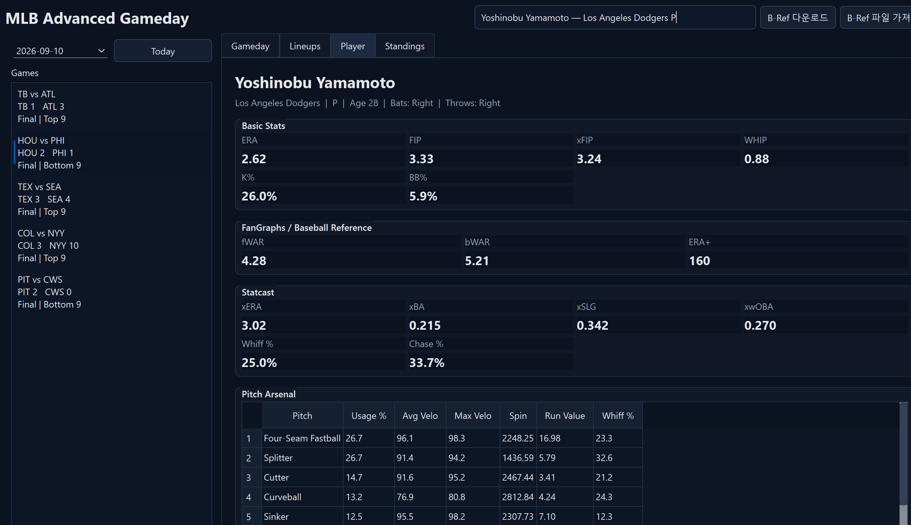

# ⚾ Dugout Atlas v1.7

Windows 11용 MLB 경기·선수 분석 데스크톱 앱입니다. 경기를 보다가 선수 분석으로 이동하고, 비시즌에는 홈에서 관심 선수와 과거 시즌을 탐색할 수 있습니다.


## 설치와 실행

1. Python 3.12 이상을 설치하고 **Add python.exe to PATH**를 선택합니다.
2. [소스 ZIP](https://github.com/dhtjr1236-eng/dugout-atlas/archive/refs/heads/main.zip)을 내려받아 압축을 풉니다.
3. `install.bat`을 실행합니다.
4. 설치가 끝나면 `run.bat`을 실행합니다.

현재 배포 형태는 Python 소스입니다. 설치형 EXE는 아직 제공하지 않습니다. 업데이트 전에는 앱을 종료하고 프로그램 폴더와 별도로 설정한 데이터 폴더를 백업하세요. 이전 버전용 패치를 최신 소스 위에 다시 적용하지 마세요.

## 주요 기능

| 화면 | 용도 |
| --- | --- |
| 홈 | 시즌 선택, 로컬 기록 보유 현황, 즐겨찾기와 분석 바로가기 |
| 경기·라인업 | 일정·점수·플레이·등판 선수 확인, 선수 클릭으로 분석 이동 |
| 선수 | 기본 기록과 FanGraphs·B-Ref·Statcast 지표, 차트와 즐겨찾기 |
| 비교·심화 비교 | 선수별 지표 비교, Season Race로 누적 WAR 변화 탐색 |
| 리그 | 순위와 팀 통계 조회 |
| 설정 | 언어·테마·글자 크기·갱신 간격·데이터 위치·캐시 관리 |

홈의 숫자는 **내 앱에 저장된 캐시 현황**입니다. MLB 전체 기록이나 최신 시즌 성적을 뜻하지 않습니다. 선수 이름을 클릭할 때는 MLBAM ID로 연결합니다. 한국어·영어·일본어와 밝은/어두운 테마를 지원합니다.



*이름 변경 전 실제 실행 화면이며, 통계는 촬영 당시 값입니다.*

## 데이터와 설정

- 소스 실행은 기존 QSettings와 설정한 데이터 위치를 유지합니다. 별도 위치가 없으면 프로젝트 폴더 아래 `data/`, `cache/`, `logs/`를 사용합니다.
- 사용자 선수명은 `%LOCALAPPDATA%\Dugout Atlas\config\player_names_override.json`으로 덮어쓸 수 있습니다. 기본 seed 파일을 직접 고치기보다 override를 사용하세요.
- 캐시는 **설정 → 캐시 관리/소스별 새로고침**에서 관리하세요. `cache/`와 `database/`에는 실행 코드도 있으므로 폴더 전체를 삭제하면 안 됩니다.
- 기존 DB·캐시·설정을 자동 이관하거나 초기화하지 않습니다.

외부 데이터의 갱신·접근 상태에 따라 일부 값은 늦거나 비어 있을 수 있습니다. 없는 WAR를 추정하거나 fWAR와 bWAR를 합산하지 않습니다. B-Ref 자동 접근이 차단되면 공식 WAR 파일을 다운로드해 앱에서 가져오세요.

## 문서

- [사용자 가이드](docs/USER_GUIDE.md): 설치, 설정, 선수명, B-Ref, 문제 해결
- [홈 사용법](docs/OFFSEASON_HOME_GUIDE_KO.md)
- [Season Race 사용법](docs/SEASON_RACE_V161_GUIDE_KO.md)
- [코드 구조](ARCHITECTURE.md)
- [변경 기록](CHANGELOG.md) · [v1.7 패치노트](docs/PATCH_v1.7.md)
- [Windows 패키징 준비](docs/WINDOWS_PACKAGING_GUIDE_KO.md): 개발자용, 설치형 배포 검증 전

과거 패치노트는 당시 변경 기록입니다. 현재 설치와 사용에는 위 가이드를 우선하세요.

## 개발자 실행과 검증

```powershell
py -3.12 -m venv .venv
.\.venv\Scripts\python.exe -m pip install -r requirements.txt -c constraints-release.txt
.\.venv\Scripts\python.exe main.py
.\.venv\Scripts\python.exe -m compileall -q .
.\.venv\Scripts\python.exe -m pytest -q
```

검증 환경과 제한은 해당 버전 패치노트를 확인하세요. Linux offscreen 테스트 통과가 Windows 실환경 검증을 대신하지는 않습니다.

MLB, FanGraphs, Baseball-Reference, Baseball Savant의 공식 클라이언트가 아닙니다. 문제 제보 시 버전·재현 순서·기대 결과를 적고, 로그의 개인정보를 확인한 뒤 공유하세요.
